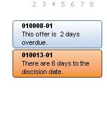



## Outlook Panel

### Description

mimicks the outlook 2007 side information panels

This is an Activex Control.

there are colors (Alert,Info,Suggest) these panels are added useing the addrecord function.

outlookpanel1.addrecord (Caption,Texte,Style)

panels can filtered by right clicking on the panels. take a look .
 
### More Info
 

             |
---                |---
**Submitted On**   |2007-03-30 17:00:02
**By**             |[Marcel Jules Rymenhout](https://github.com/Planet-Source-Code/PSCIndex/blob/master/ByAuthor/marcel-jules-rymenhout.md)
**Level**          |Beginner
**User Rating**    |4.5 (18 globes from 4 users)
**Compatibility**  |VB 6\.0
**Category**       |[Custom Controls/ Forms/  Menus](https://github.com/Planet-Source-Code/PSCIndex/blob/master/ByCategory/custom-controls-forms-menus__1-4.md)
**World**          |[Visual Basic](https://github.com/Planet-Source-Code/PSCIndex/blob/master/ByWorld/visual-basic.md)
**Archive File**   |[Outlook\_Pa2057333302007\.zip](https://github.com/Planet-Source-Code/marcel-jules-rymenhout-outlook-panel__1-68244/archive/master.zip)

